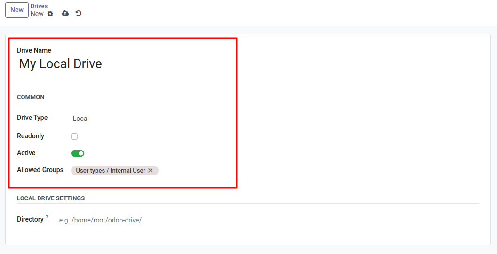

# Common Drive Settings

All [Cloudlink Drives] have the following options in common.

### Name

The name of the drive.

### Type

The storage type of the drive. List of all available [Cloudlink Drives]

### Readonly

Makes a drive read-only. Some drive types are always read-only. 

### Active

If a drive is active, it is mounted by the system. Otherwise, the drive is inaccessible.

### Allowed Groups

A list of groups, who can access the drive. Users only see the drives they have access to. A [`Cloudlink Administrator`]() is always granted access.

## Screenshot

---

[Cloudlink Drives]: 