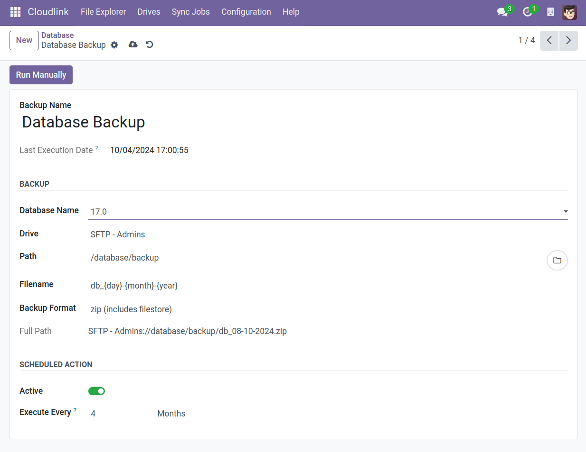

# Automatic Database Backup



The  module allows you to backup your database directly
to one of the [cloud storages] compatible with Cloudlink (Google Drive, OneDrive, SFTP, ...).
The backup will be performed at the specified interval. A [Cloudlink Administrator] can also manually trigger the backup.

## Restore

The built in Odoo Database Manager (at `<your-domain>/web/database/manager`) can be used to restore
the database from a backup file.

## Backup Settings

### Name

The name of the backup task.

### Database Name

The name of the database.

### Destination drive

The [Cloudlink Drive] on which the backup is stored.

### Destination path

The location of the backup.

### Filename

The name of the backup file.
The filename can contain the following placeholders:

- `name` - Name
- `db_name` - Database Name
- `second` - Second as a zero-padded number
- `minute` - Minute as a zero-padded number
- `hour` - Hour as a zero-padded number
- `day` - Day of the month as a zero-padded decimal number
- `month` - Month as a zero-padded number
- `year` - Year with century

Default: `{db_name}-{day}{month}{year}` 

### Format

Options:
- zip (includes filestore)
- pg_dump (without filestore)

### Active

Specifies whether the job is executed automatically.

### Execute Every

Run job every x Minutes/Hours/Days/Weeks/Months

### Next Execution Date

Next planned execution date for this job

### Notification Type

Options:

- None - no notification
- Email - Send email notificaiton on job failure

### Recipient

Recipient of the email

[cloud storages]: 
[Cloudlink Drive]: 
[Cloudlink Administrator]: 