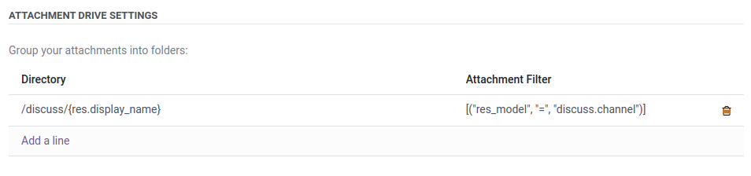
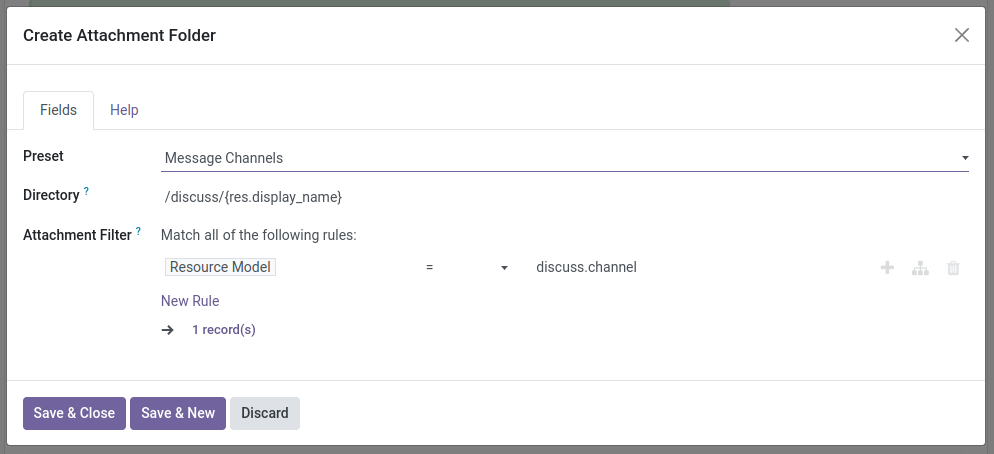
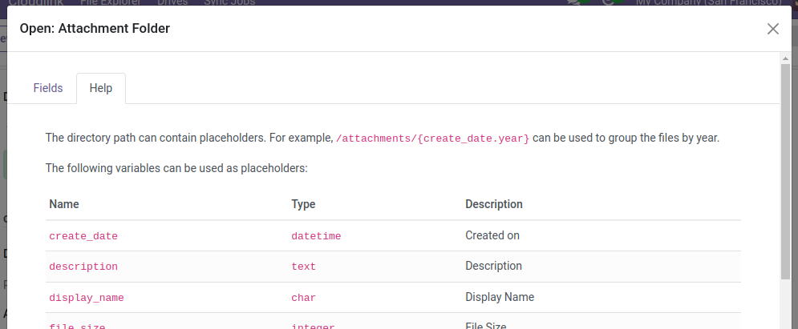
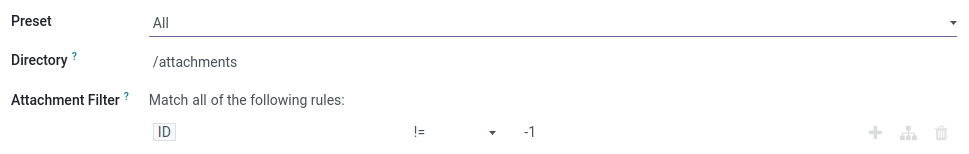
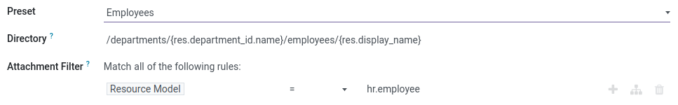
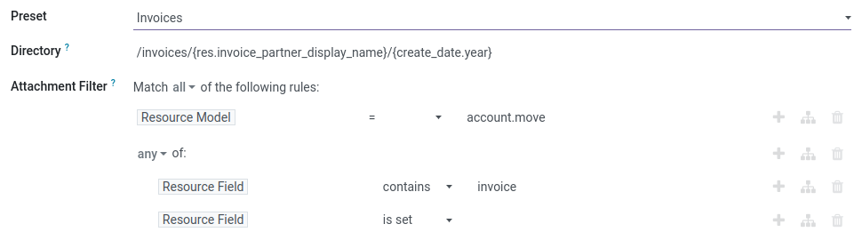
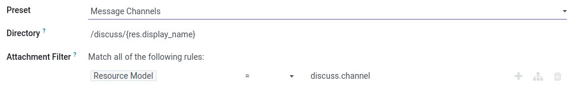
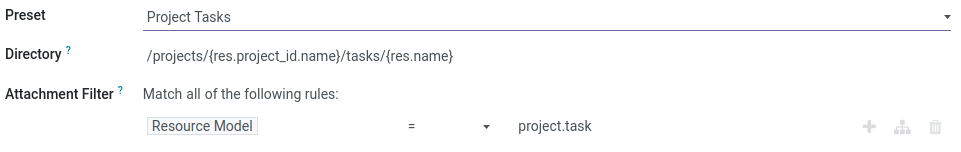
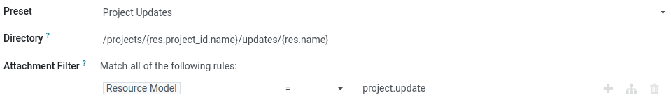

# Attachment Drive



Attachment Drives help you organize your attachments by allowing you to create a meaningful folder structure for them.  
You can use a [Sync Job] to back up your attachments.

{: .note }
An Attachment Drive is always **read-only**

## Attachment Drive Settings

The Settings of an Attachment Drive consist of a list of `Attachment Folders`.
An `Attachment Folder` has a path and a filter to determine which attachments should be included.

#### Attachment Folder Settings: 

### Directory

The path of the `Attachment Folder`. The path can contain placeholders.

#### Examples:
- `/projects/{create_date.year}` - group files by year  
  Results: `/projects/2024`, `/projects/2023`, ... 
- `/invoices/{res.invoice_partner_display_name}` - group files by the name of the partner  
  Results: `/invoices/Deco Addict`, `/invoices/Wood Corner`, ...

A list of all available placeholder variables can be found under the `Help` tab.

### Attachment Filter

A [Domain] to select attachments that match the specified criteria.
When the domain includes `(Resource Model, =, MODEL_NAME)`, all the fields of `MODEL_NAME` will be available as `res.FIELD_NAME` variables.

## Presets

To simplify the setup the module provides some `Attachment Folder` presets. 

### All

### Employees

### Invoices

### Channel Messages

### Project Tasks

### Project Updates

---

[Sync Job]: 
[Domain]: https://www.odoo.com/documentation/{{site.content.version}}/developer/reference/backend/orm.html#reference-orm-domains

