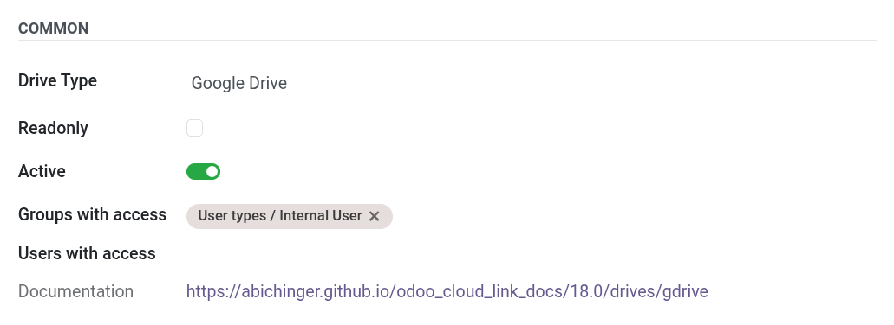

# Common Drive Settings

All [Cloudlink Drives] share a set of common configuration options, regardless of the provider.

## General Settings

### Name

A descriptive name for the drive (e.g., "Marketing Dropbox", "Backup S3"). This name appears in the File Explorer.

### Type

The storage provider (e.g., Google Drive, Local, Dropbox).

### Readonly

If checked, the drive is mounted as read-only. Users can view and download files but cannot upload, edit, or delete them.
*Note: Some drive types may enforce read-only mode automatically.*

### Active

Uncheck this to disable the drive without deleting the configuration. Inactive drives are not mounted and not visible in the Explorer.

## Access Control

You can restrict visibility and access to specific users or groups. If no users or groups are selected, the drive might be visible to all internal users (depending on default policy) or only admins.

### Groups with access

Select Odoo user groups that should have access (e.g., "Sales / User: All Documents").

### Users with access

Select specific users to grant access to individuals.

## Security Note

*   Users only see drives they are explicitly granted access to, or drives that are open to their groups.
*   A **Cloudlink Administrator** always has full access to all drives.

[Cloudlink Drives]: 
