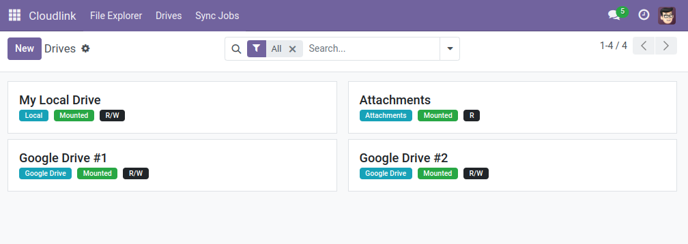

# Drives

[Cloudlink] supports various data storages that can be mounted as drives. You can create multiple drives of the same type.

{: .note }
Some drives require a Cloudlink extension module. Select a drive type for more information.

[Cloudlink]: 