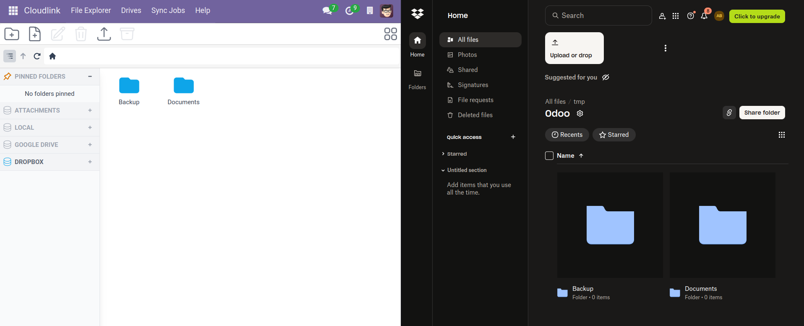
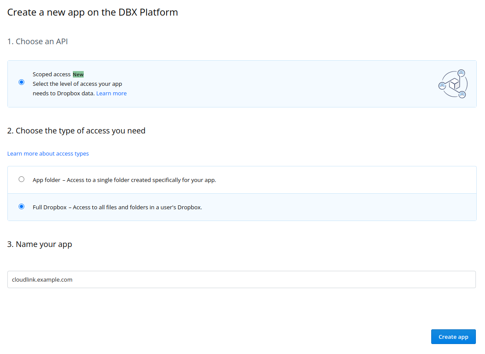
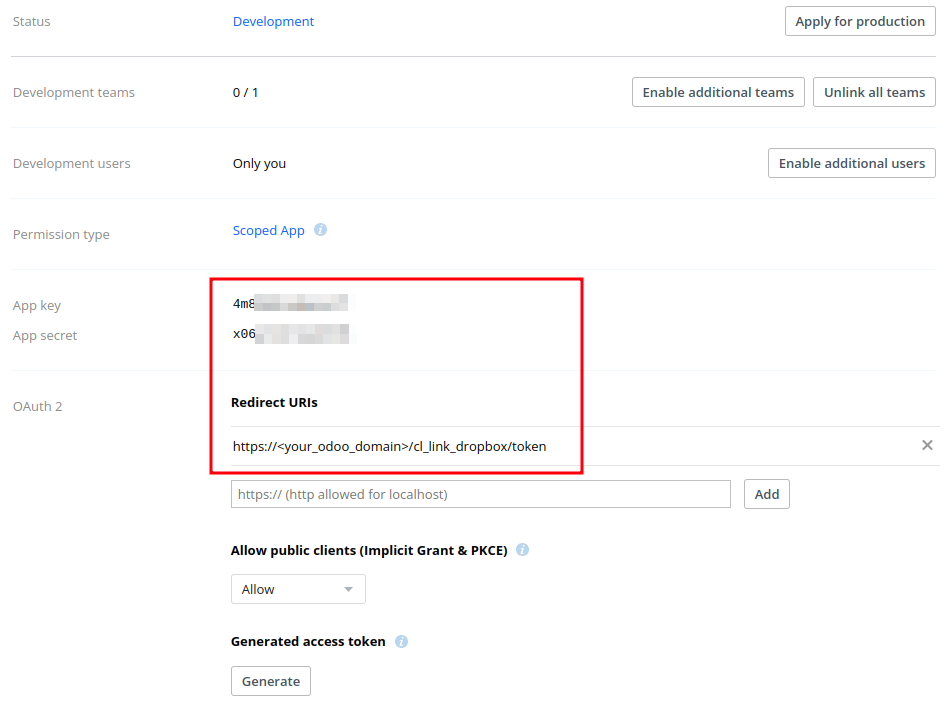
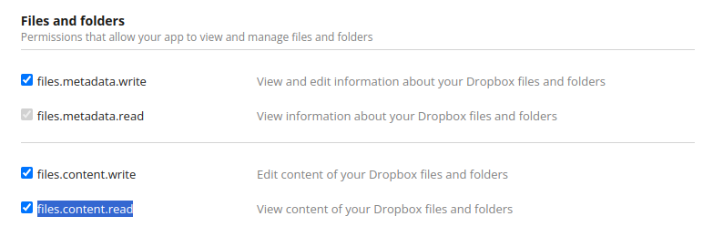
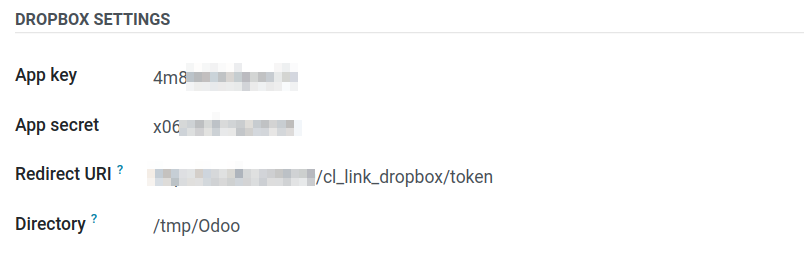

# Dropbox



With  you can easily connect Odoo to your Dropbox.

## Setup

### [OAuth 2.0 authorization code flow](https://developers.dropbox.com/de-de/oauth-guide)

1. Create a new app in the [App Console]

2. Add a Redirect URI to your application. The redirect URI should be `https://<your_odoo_domain>/cl_link_dropbox/token`

3. Give the app the following permissions: `files.metadata.write`, `files.metadata.read`, `files.content.write` and `files.content.read`

4. Create a new Cloudlink Drive and enter the Dropbox app details.

## Dropbox Drive Settings

### App key

App key of your Dropbox app. Can be found in the [App Console].

### App secret

App secret of your Dropbox app. Can be found in the [App Console].

### Redirect URI

Destination when returning tokens after successfully authenticating.

### Directory

The directory to mount. (default: `/`)

[App Console]: https://www.dropbox.com/developers/apps
