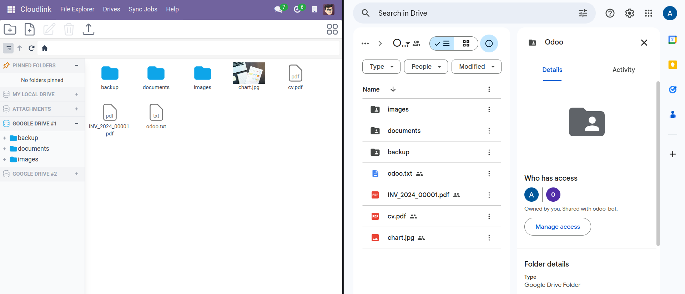
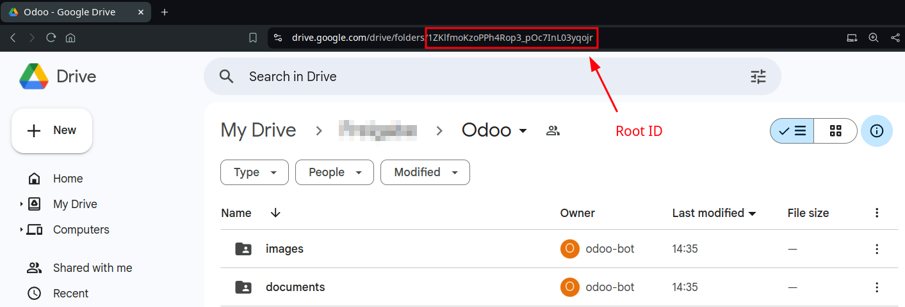
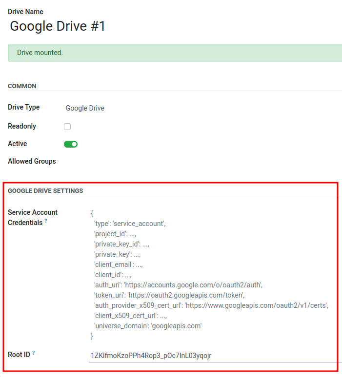

# Google Drive



 allows you to connect Odoo with Google Drive. 
This extension is ideal if you want to back up your documents to the cloud.

## Setup

1. Create a [Google Cloud Project](https://developers.google.com/workspace/guides/create-project#project)
2. Enable the [Google Drive API](https://console.cloud.google.com/flows/enableapi?apiid=drive.googleapis.com)
3. Create a [service account] and note its email.
4. Create a [service account key] and save it in JSON format. Copy the content of the JSON file into the [Service Account Credentials] field
5. Share a Google Drive folder with the [service account] email

## Google Drive Settings

### Service Account Credentials

A [service account key] in JSON format.

### Root ID

The id of a shared drive.

[service account]: https://cloud.google.com/iam/docs/service-accounts-create
[service account key]: https://cloud.google.com/iam/docs/keys-create-delete?hl=en#creating
[Service Account Credentials]: #service-account-credentials
