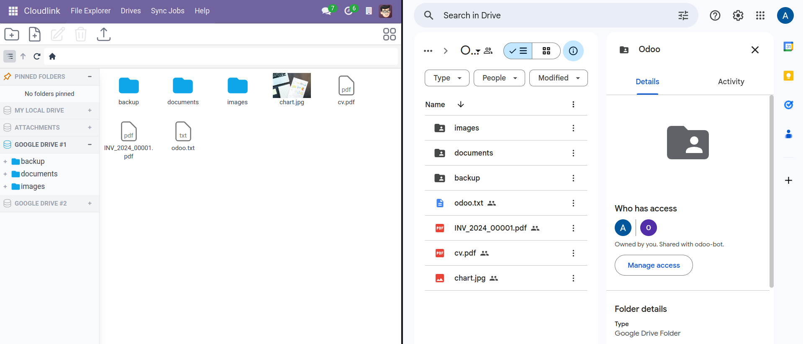
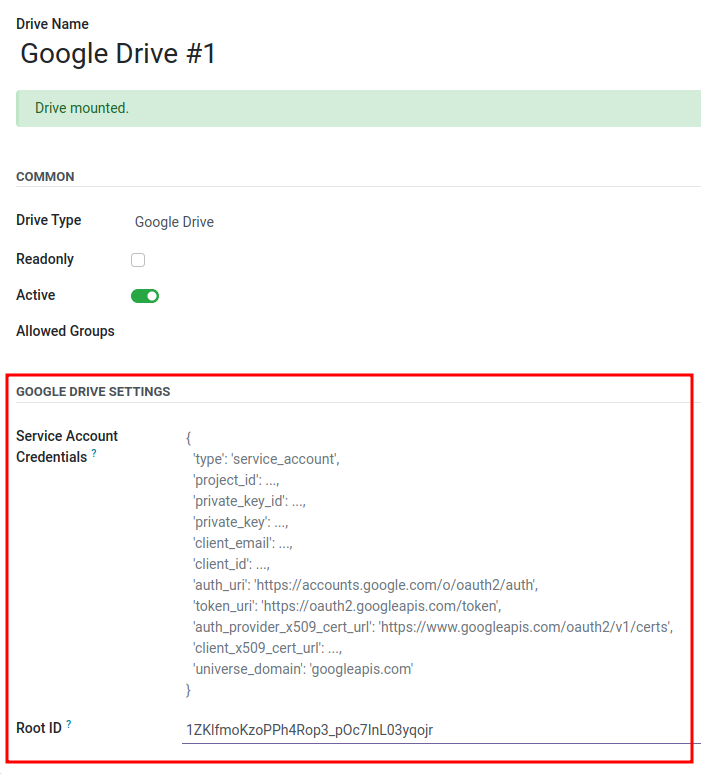
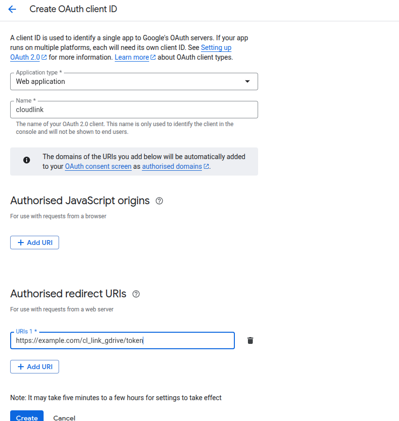
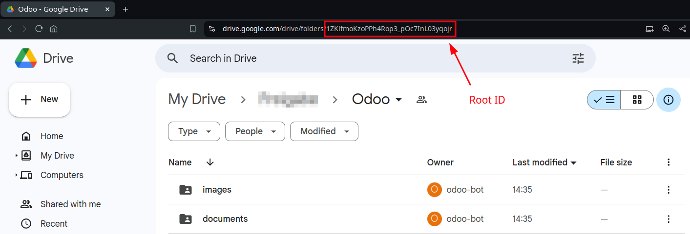

# Google Drive



 allows you to connect Odoo with Google Drive. 
This extension is ideal if you want to back up your documents to the cloud.

## Setup

You can connect Google Drive to Odoo via **two authentication flows**.

### Service Account Flow (Recommended)

1. Create a [Google Cloud Project](https://developers.google.com/workspace/guides/create-project#project)
2. Enable the [Google Drive API](https://console.cloud.google.com/flows/enableapi?apiid=drive.googleapis.com)
3. Create a [service account] and note its email.
4. Create a [service account key] and save it in JSON format. Copy the content of the JSON file into the [Service Account Credentials] field
5. Share a Google Drive folder with the [service account] email
6. Fill [Root ID] with the id of your shared drive.

---

### Authorization Code Flow (User-based, OAuth, recommended for standard Google accounts)

1. Create a [Google Cloud Project](https://developers.google.com/workspace/guides/create-project#project)
2. Enable the [Google Drive API](https://console.cloud.google.com/flows/enableapi?apiid=drive.googleapis.com)
4. Create [OAuth 2.0 Client Credentials](https://developers.google.com/workspace/guides/create-credentials) (Click "Create Client"). **Application type**: Web application.
5. Add the **Redirect URI** shown in the Odoo Google Drive form to the list of redirect URIs in Google Cloud Console. `https://<your_odoo_domain>/cl_link_gdrive/token`
6. Download the OAuth **client secret JSON** file. Paste its content into the **Client Secret File** field in Odoo.
7. Click **"Authorize"** in the Odoo Google Drive form and complete the browser-based login/consent flow.
8. Once authorized, the refresh token is saved and used for API access.
9. Fill [Root ID] with the id of your shared drive.

---

## Google Drive Settings

### Service Account Credentials

A [service account key] in JSON format.

### Client Secret File

OAuth client secret (JSON) downloaded from Google Cloud Console, required when using the **Authorization Code Flow**.

### Redirect URI

The URI that must be added to the list of authorized redirect URIs in the OAuth credentials in Google Cloud. This value is auto-generated by Odoo. Copy it from the form and use it in the Google Cloud Console setup for your OAuth client.

### Root ID

The id of a shared drive.

---

[service account]: https://cloud.google.com/iam/docs/service-accounts-create
[service account key]: https://cloud.google.com/iam/docs/keys-create-delete?hl=en#creating
[Service Account Credentials]: #service-account-credentials
[Root ID]: #root-id
