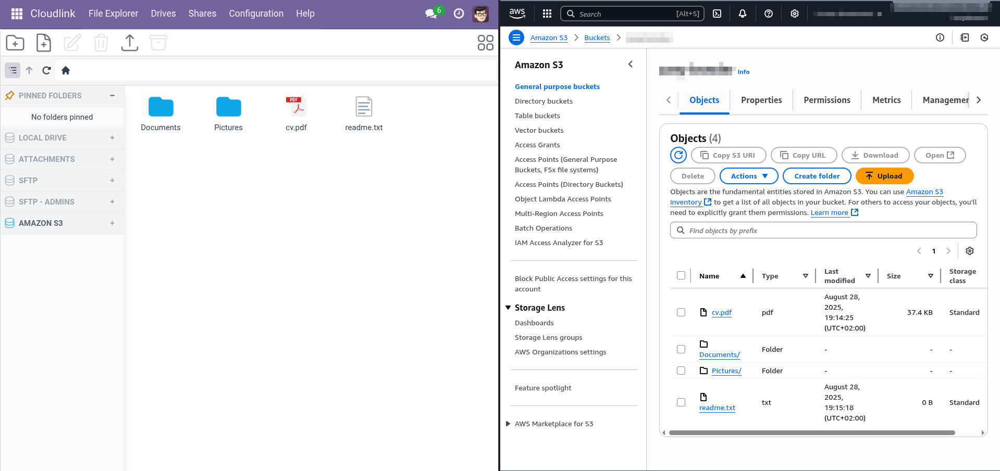
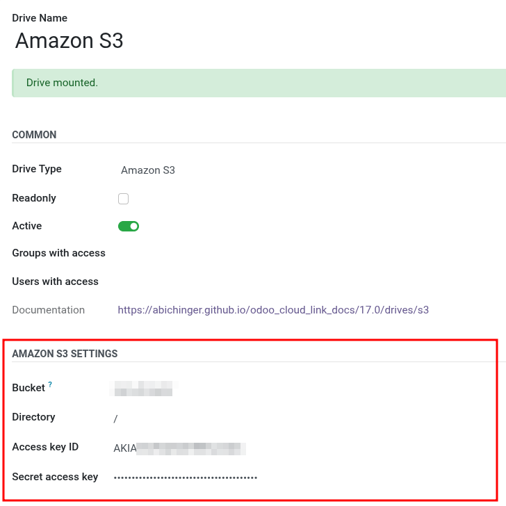

# Amazon S3



 allows you to connect Odoo with [Amazon S3]. This extension is ideal if you want to back up your documents to Amazon's cloud storage.

## Setup

To connect [Amazon S3] to Odoo, you need to provide your S3 credentials and bucket information.

### Prerequisites

1. An Amazon Web Services (AWS) account
2. An [S3 bucket] created in your AWS account
3. [Access Key] ID and Secret Access Key with permissions to access the bucket

---

### Configuration Steps

1. Go to **Cloudlink -> Drives** and click on **New**.
2. Select **Amazon S3** as **Drive Type**.
3. Enter your **Bucket** name (the name of your S3 bucket).
4. Optionally, specify a **Directory** (defaults to `/`).
5. Enter your **Access Key ID** and **Secret Access Key**. These are your AWS credentials.
6. Save the configuration.

---

## Amazon S3 Settings

### Bucket
The name of your Amazon S3 bucket. You must create this bucket in your AWS account before connecting.

### Directory
The directory (prefix) within your bucket to use as the root. Defaults to `/` (the bucket root).

### Access Key ID
Your AWS Access Key ID. This is required to authenticate with Amazon S3.

### Secret Access Key
Your AWS Secret Access Key. This is required to authenticate with Amazon S3. Keep this value secure.

---

## Security

- Only users with the appropriate permissions (system and Cloud Link admin) can configure Amazon S3 settings.
- Credentials are stored securely in Odoo.

---

<!--
## Usage

Once configured, you can use Amazon S3 as a storage backend for attachments, file management, and backups in Odoo via the Cloud Link interface.

---

-->

[Amazon S3]: https://aws.amazon.com/s3/
[Access Key]: https://docs.aws.amazon.com/IAM/latest/UserGuide/id_credentials_access-keys.html
[S3 Bucket]: https://docs.aws.amazon.com/AmazonS3/latest/userguide/create-bucket-overview.html
