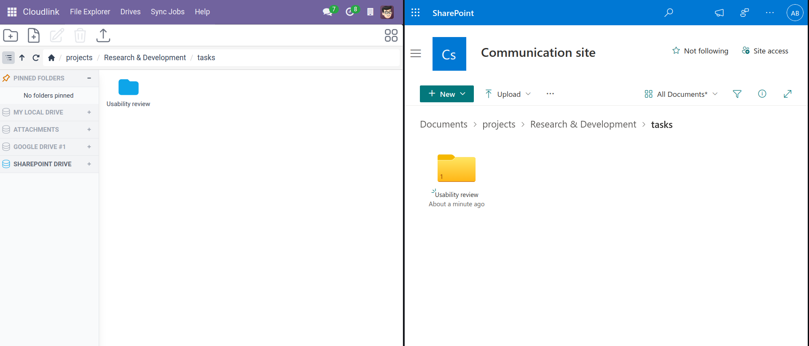
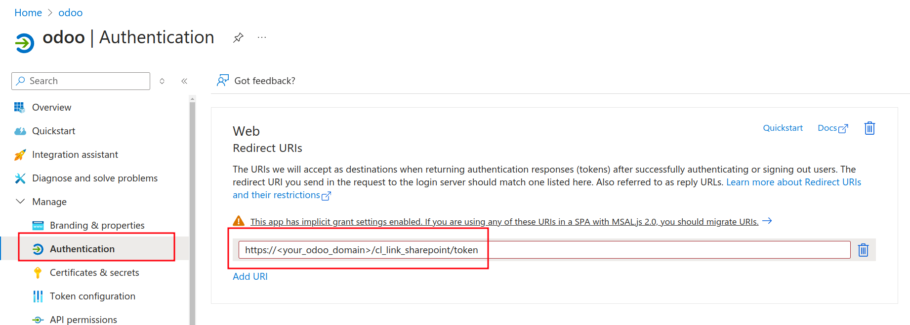
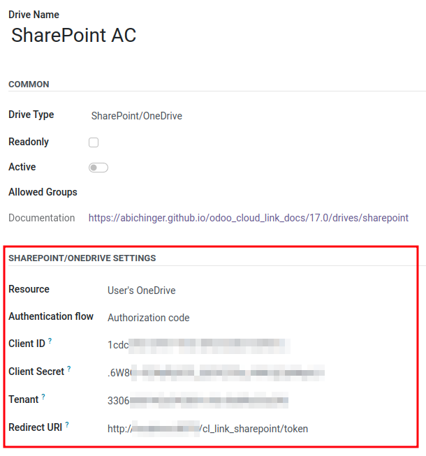
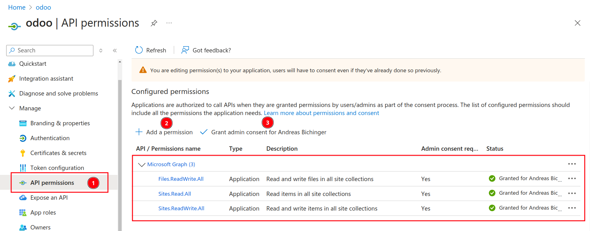
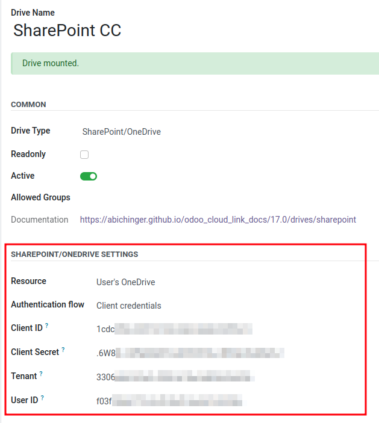

# SharePoint & OneDrive



With the extension  you can integrate the following resources into Odoo:
- A user's OneDrive
- A SharePoint site
- A Drive by the drive's ID

## Setup

Make sure you have a [Microsoft 365](https://www.microsoft.com/en-us/microsoft-365/business) subscription for Business if you plan to do any of the following:
- Access a OneDrive for Business
- Access a SharePoint Site
- Use the client credentials flow

It is possible to access a Personal OneDrive without a Microsoft 365 subscription.

### [OAuth 2.0 authorization code flow](https://learn.microsoft.com/en-us/entra/identity-platform/v2-oauth2-auth-code-flow)

1. [Register an application] with the Microsoft identity platform
  - Supported account types: Accounts in any organizational directory and personal Microsoft accounts
2. Add a [client secret] to your application
3. Add a [Web Redirect URI] to your application. 
The redirect URI should be `https://<your_odoo_domain>/cl_link_sharepoint/token`

4. Create a new Cloudlink Drive

 
### [OAuth 2.0 client credentials flow](https://learn.microsoft.com/en-us/entra/identity-platform/v2-oauth2-client-creds-grant-flow)

1. [Register an application] with the Microsoft identity platform
  - Supported account types: Accounts in any organizational directory and personal Microsoft accounts
2. Add a [client secret] to your application
3. Add the following permissions to access Microsoft Graph (Admin consent is required)
  - `Files.ReadWrite.All`
  - `Sites.ReadWrite.All`

4. Create a new Cloudlink Drive

## OneDrive/SharePoint Drive Settings

### Resource

The type of resource you would like to access.

### Authentication flow

An OAuth 2.0 token grant flow

Available options:
- Authorization code flow
- Client credentials flow

### Client ID

Entra Application ID

### Client Secret

Client credentials

### Tenant

Directory (tenant) ID

{: .note }
Use "**consumers**" to access the OneDrive of a personal Microsoft account 

### Redirect URI

Destination when returning tokens after successfully authenticating

### User ID

The user's ID

### Site ID

The ID of a SharePoint site

### Drive ID

The id of a drive.

[Register an application]: https://learn.microsoft.com/en-us/entra/identity-platform/quickstart-register-app?tabs=client-secret#register-an-application
[client secret]: https://learn.microsoft.com/en-us/entra/identity-platform/quickstart-register-app?tabs=client-secret#add-credentials
[Web Redirect URI]: https://learn.microsoft.com/en-us/entra/identity-platform/quickstart-register-app?tabs=certificate#add-a-redirect-uri
