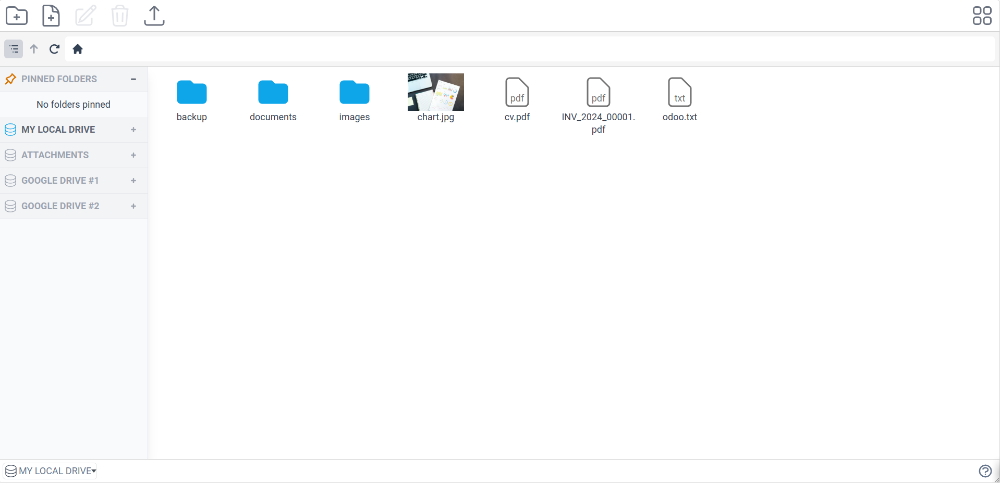

# File Explorer



The integrated File Explorer makes it easy to manage your files and folders. You will have access to all your mounted drives and can switch between them.

## Supported operations

- Create new files/folders
- Rename
- Delete
- Download/Upload files

## Features

- Breadcrumb links
- Image thumbnails
- List and Grid view
- Drag & drop support
- Pinned folders