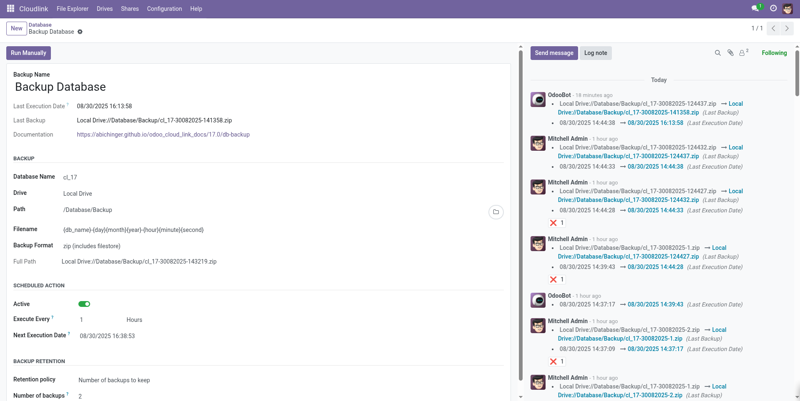

# Automatic Database Backup



The  module allows you to backup your database directly to any configured [Cloudlink Drive] (Google Drive, Dropbox, S3, etc.). Backups can be scheduled to run automatically at specified intervals, and old backups can be automatically rotated.

## Configuration

1.  Navigate to **Cloudlink > Configuration > Database Backups**.
2.  Click **New**.
3.  Configure the backup settings (see below).
4.  Activate the job.

## Backup Settings

### Name

A descriptive name for the backup job.

### Database Name

The exact name of the PostgreSQL database to backup.

### Destination

- **Destination drive**: The drive where the backup will be saved.
- **Destination path**: The folder path on the drive (e.g., `/backups`).

### Filename

The naming pattern for the backup file. Smart placeholders are supported:

- `{db_name}`: Database Name
- `{year}`, `{month}`, `{day}`: Date components
- `{hour}`, `{minute}`, `{second}`: Time components

**Default:** `{db_name}-{day}{month}{year}`

### Format

- **zip (includes filestore)**: Full backup including attachments.
- **pg_dump (without filestore)**: SQL dump only. Faster and smaller, but excludes attachments.

### Scheduling

- **Active**: Must be checked for automatic execution.
- **Execute Every**: The frequency of the backup (e.g., every 1 Day).
- **Next Execution Date**: When the backup will run next.

### Backup Retention

Manage storage usage by automatically deleting old backups.

- **Keep all**: Never delete backups.
- **Number of backups to keep**: Specify a count (e.g., 7 to keep the last 7 backups). Oldest files are deleted when new ones are created.

## Restore

To restore a backup:
1.  Download the backup file from the drive.
2.  Go to the Odoo Database Manager (`<your-domain>/web/database/manager`).
3.  Use the **Restore Database** feature and upload the file.

## Notifications

If a backup job fails, a notification is sent to the followers of the backup record. Add yourself as a follower to receive alerts via email or Odoo Discuss.

[Cloudlink Drive]: 
