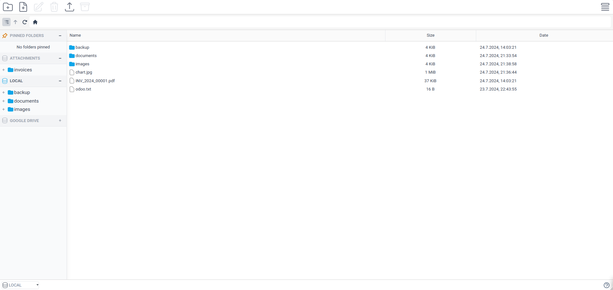

# Use the File Explorer



The integrated File Explorer allows you to browse and manage files across all your mounted drives from a single interface. It provides a familiar desktop-like experience within Odoo.

## Accessing the Explorer

Go to **Cloudlink > File Explorer** to open the explorer.
You will see a list of your mounted drives on the left sidebar. Click a drive to browse its contents.

**Contextual Access:**
You can also access the File Explorer directly from Odoo records (like Partners or Sales Orders) if the **[Filestore]** is configured with the **File Explorer** option enabled. This opens a the File Explorer of the files and folders associated with that specific record.

## Features & Operations

### Basic Operations
- **Upload**: Drag and drop files from your computer or use the Upload button.
- **Download**: Select files and click Download. You can download folders or multiple files as a ZIP archive.
- **Create**: Create new folders and empty files.
- **Rename/Delete**: Right-click or use the context menu to rename or delete items.

### View Modes
- **List View**: detailed view with columns.
- **Grid View**: Large icons, great for images.

### Preview
- **File Preview**: Click on images, PDFs, and text files to preview them directly in the explorer without downloading.
<!-- - **Thumbnails**: Images display thumbnails for quick identification. -->

### Navigation
- **Breadcrumbs**: Use the top bar to navigate back up the folder hierarchy.
- **Pinned Folders**: Pin frequently accessed folders for quick access.

[Filestore]: 

