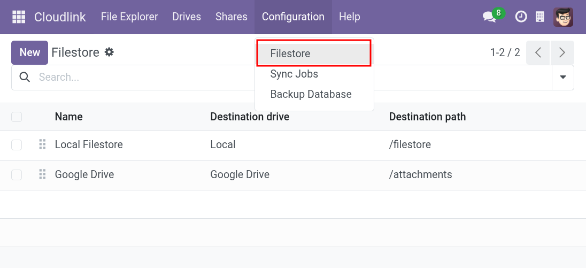
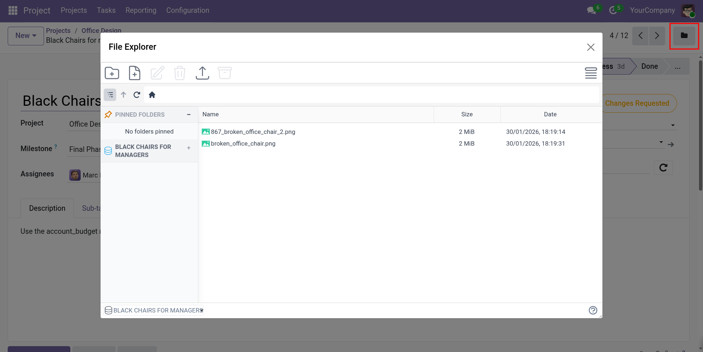
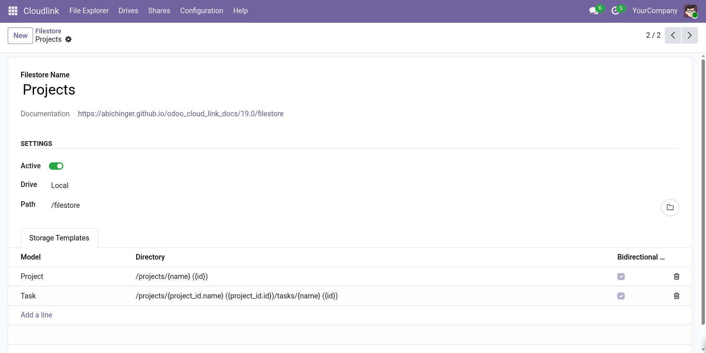

# Set up a Filestore



The Filestore feature allows you to store Odoo attachments (files) directly on a [Cloudlink Drive] (Google Drive, OneDrive, SFTP, etc.) instead of the local Odoo server. This is useful for offloading storage, centralizing files, or integrating with external storage providers.

Attachments are stored on the configured drive and path. You can restrict which Odoo models use the Filestore. When enabled, attachments for the selected models will be uploaded to the cloud drive and accessible via secure URLs.



## How it Works

- When a user uploads an attachment, Cloudlink searches for a matching **Storage Template** within your active Filestores.
- If a match is found for the record's model, the file is uploaded to the cloud drive using the path defined in the template.
- The attachment is stored as a URL in Odoo.
- If **Bidirectional Sync** is enabled, files added directly to the cloud folder are automatically synced back to Odoo when the record is accessed.

### Storage Templates & Folder Structure

Storage Templates define how files are organized on the drive. You can define specific templates for different Odoo models or a default template for all other models.

The **Directory** field in a template supports dynamic placeholders to create a structured hierarchy.

**Supported Placeholders:**

- `{res_model}`: The technical model name (e.g., `res.partner`).
- `{id}`: The record ID (Required).
- `{FIELD_NAME}`: Any field on the record (e.g., `{name}`, `{create_date.year}`, `{company_id.name}`).

> **Note:** The directory template must always contain the `{id}` placeholder to ensure files are associated with the correct record.

**Example:**

With a directory template of `/{res_model}/{create_date.year}/{name} ({id})`, a file attached to a partner named "Azure Interior" created in 2024 would be stored at:

```
/res.partner/2024/Azure Interior (99)/99_contract.pdf
```

The filename is automatically prefixed with the attachment ID to prevent conflicts.

### Bidirectional Sync

If **Bidirectional Sync** is enabled on a Storage Template, Cloudlink will monitor the folder associated with a record.
- When a user opens a record in Odoo, Cloudlink checks the corresponding folder on the drive.
- Any new files found in that folder are automatically imported into Odoo as attachments.
- A notification is sent to the user upon completion.

This allows for seamless workflows where files are dropped into a folder (e.g., via FTP or shared drive) and immediately appear in Odoo.

### Record-Specific File Explorer



You can enable a **File Explorer** directly on Odoo records (e.g., on a Customer or Sales Order).

1. Enable **File Explorer** on the matching Storage Template.
2. Go to a record of that model (e.g., a Partner).
3. Click the **Folder** icon in the control panel (top right).
4. A popup window opens the File Explorer, showing **only** the files and folders for that specific record.

This allows users to manage files for a specific context without leaving the record workflow.

{: .tip }
To move existing attachments to the Filestore, see the guide: [Move existing attachments].

## Filestore Settings



### Name

The name of the Filestore configuration.

### Active

Specifies whether this Filestore is active.

### Drive

The [Cloudlink Drive] where attachments will be stored.

### Path

The root folder on the drive for this Filestore (e.g., `/attachments`). All Storage Template paths are relative to this root.

### Storage Templates

Define one or more templates to map Odoo models to directory structures.

- **Model**: Restrict the template to a specific model. Leave empty to apply to all other models.
- **Directory**: The folder path pattern (see Folder Structure).
- **Bidirectional**: Enable two-way sync for this model.
- **File Explorer**: Enable the file explorer interface on the record form.

### Sequence

Determines the order in which Filestores are matched. Lower numbers have higher priority.

## Access & Security

- Attachments are accessible via secure, tokenized URLs.
- When an attachment is deleted in Odoo, the file is also removed from the cloud drive.

[Cloudlink Drive]: 
[Move existing attachments]: 
