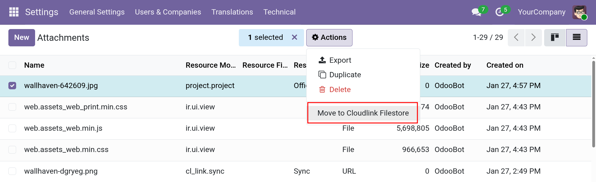

# Move existing attachments to a Filestore



If you have existing attachments in Odoo (stored in the database or local filestore) and want to move them to a configured Cloudlink Filestore, you can use the **Move to Cloudlink Filestore** action.

## Prerequisites

- You must have at least one active **[Filestore]** configured.
- The Filestore must have a **Storage Template** that matches the model of the attachments you want to move.

## Steps to Move Attachments

1.  Enable **Developer Mode** (Settings > General Settings > Developer Tools > Activate the developer mode).
2.  Navigate to **Settings > Technical > Database Structure > Attachments**.
3.  Select the attachments you want to move from the list.
    *   You can use filters to find attachments for specific models (e.g., `Resource Model contains res.partner`).
4.  Click the **Actions** button (gear icon or "Actions" menu) and select **Move to Cloudlink Filestore**.

## How it works

The migration process runs in the background to avoid timing out when moving large numbers of files.

1.  **Validation**: The system checks if there is a matching Filestore for each selected attachment. If no match is found, an error is raised immediately.
2.  **Scheduling**: A background job (Scheduled Action) is created to process the files.
3.  **Processing**: The job moves the file content to the cloud drive and updates the attachment record in Odoo to point to the new location (changing `type` to `url`).

{: .note }
Attachments are moved one by one. If an error occurs with a specific file, it will remain in its original location, and the error will be logged.

[Filestore]: 
