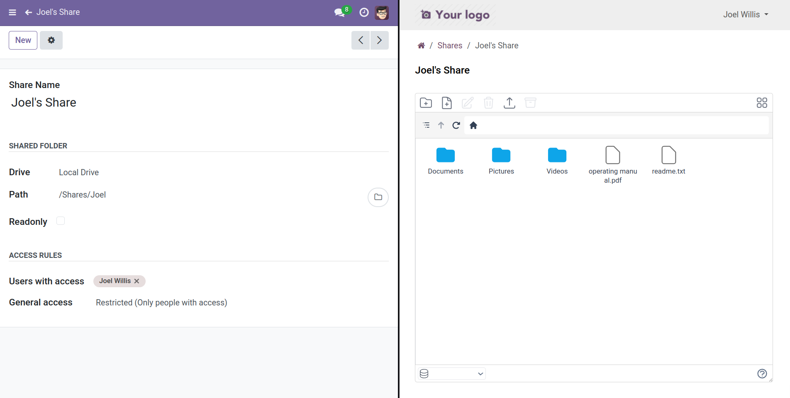
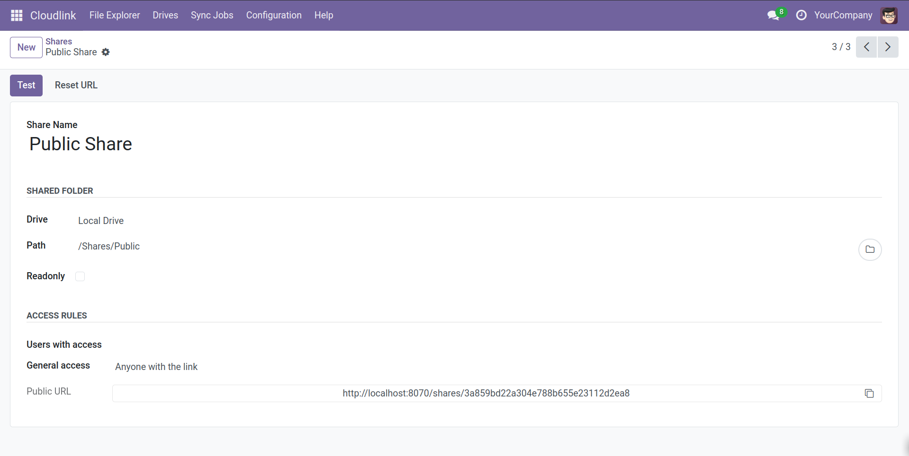
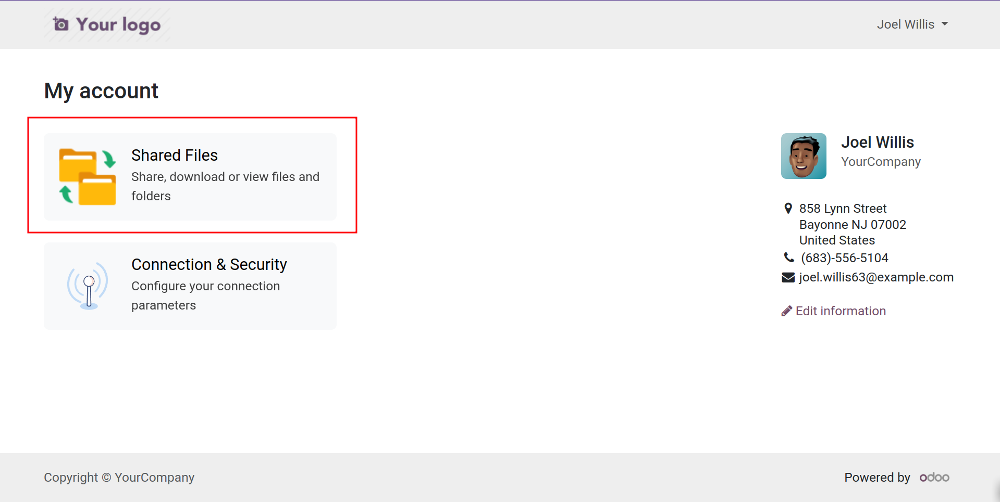
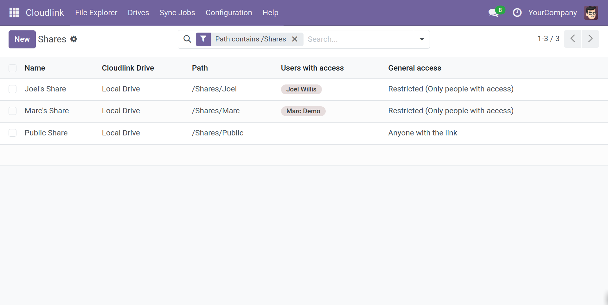

# Share files and folders with customers



 enables seamless file sharing with external partners. You can share files and folders with specific partners or create public links. Access can be configured as read-only or editable for collaboration.

## Creating a Share

1.  Navigate to **Cloudlink > Shares**.
2.  Click **New**.
3.  Configure the share settings (see below).
4.  Copy the share link or assign users.

## Share Settings

### Name

The name of the share as it will appear to users.

### Drive

The [Cloudlink Drive] where the shared folder is located.

### Path

The path to the folder or file you want to share.

### Readonly

If checked, external users can only view and download files. They cannot upload, rename, or delete files.

### Users with access

Select specific Odoo partners/users who should have access. They will see the share in their portal under `/my/shares`.

### General access

- **Restricted**: Only listed users can access the share.
- **Anyone with the link**: The share is public. Anyone with the URL can access it without logging in.

## Portal View

Partners can access shared folders via their portal account.

- **My Shares**: `https://<your_odoo_domain>/my/shares`

When opening a share, they get a full file explorer interface to manage files (if permitted).

## Endpoints

- `https://<your_odoo_domain>/my/shares` - List of private shares.
- `https://<your_odoo_domain>/my/shares/<share_id>` - Direct link to a private share.
- `https://<your_odoo_domain>/shares/<access_token>` - Public access link.

[Cloudlink Drive]: 
