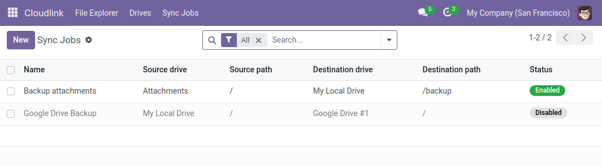
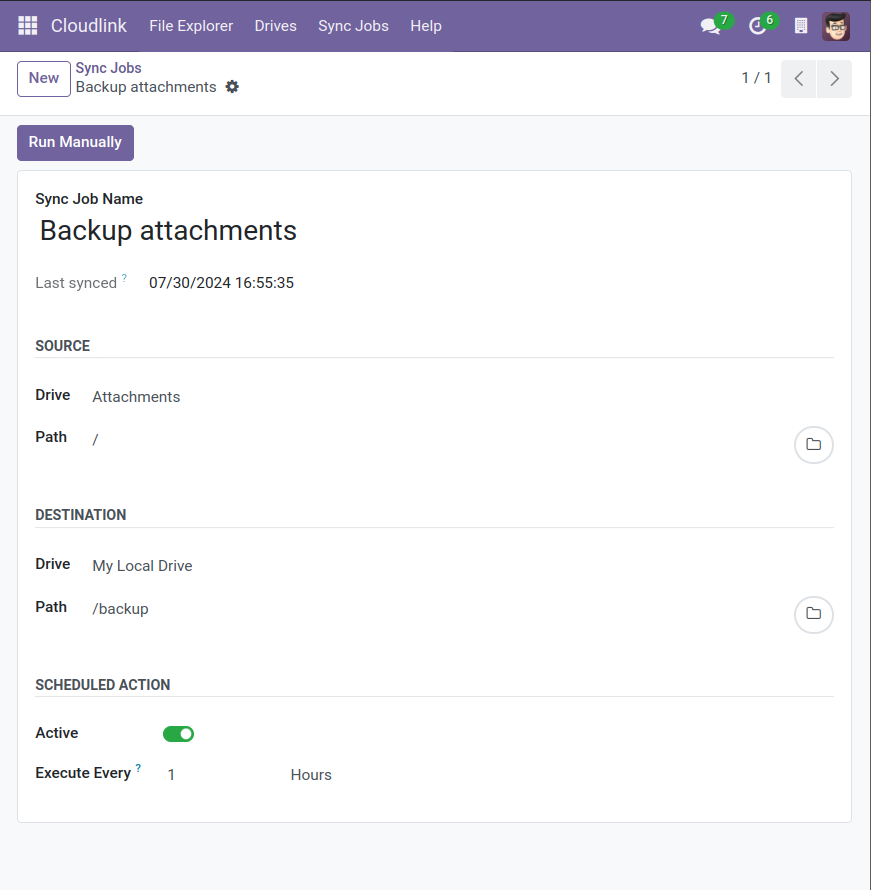

# Synchronize files between drives



Sync Jobs allow you to automatically copy or mirror a directory from one drive to another. This is useful for backups, migrations, or keeping a local folder in sync with a cloud drive. The synchronization occurs automatically at a specified interval.

## Creating a Sync Job

1.  Navigate to **Cloudlink > Automation > Sync Jobs**.
2.  Click **New**.
3.  Configure the source and destination.
4.  Set the schedule.

## Configuration

### Source & Destination

- **Source Drive / Path**: The folder to read from.
- **Destination Drive / Path**: The folder to write to.

### Scheduling

- **Active**: Check to enable automatic execution.
- **Execute Every**: The interval between runs (e.g., every 24 Hours).
- **Next Execution Date**: The next scheduled run time.

## Notifications

If a sync job fails, a notification is sent to the followers of the sync record. Add yourself as a follower to receive alerts via email or Odoo Discuss.

## Performance Note

{: .note }
Syncing large folders can take time. By default, Odoo kills background workers after a certain timeout (often 120 seconds).
For long-running Sync Jobs, you may need to increase the [`limit-time-real`](https://www.odoo.com/documentation/{{site.content.version}}/developer/reference/cli.html#cmdoption-odoo-bin-limit-time-real) parameter in your Odoo configuration file (`odoo.conf`).

[Cloudlink Administrator]: 
