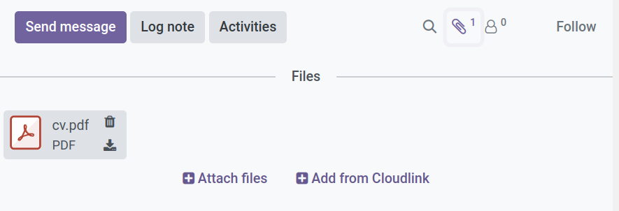

# Create URL Attachments



The  extension allows you to attach files to Odoo records directly from a [Cloudlink Drive], without uploading/duplicating the file content. Odoo stores a reference (URL) to the file.

## How to attach a file

1.  Open any record in Odoo (e.g., a Sales Order or Project Task).
2.  Click the **Attachments** / paperclip icon.
3.  Select **Add from Cloudlink**.
4.  Browse your mounted drives and select the file.
5.  Click **Add**.

The file now appears as an attachment on the record. Clicking it will open or download the file from the cloud drive.

<video width="100%" controls>
  <source src="../assets/url_attachment.mp4" type="video/mp4">
Your browser does not support the video tag.
</video>

## Important Considerations

{: .warning }
Since the attachment is a link, it depends on the availability of the file on the drive.
*   **Availability**: The drive must be mounted for the attachment to be accessible.
*   **Broken Links**: The attachment link will break if the file is deleted or moved on the drive.
*   **Renaming Drives**: Renaming a drive in Cloudlink generally does not break existing attachments.

[Cloudlink Drive]: 
