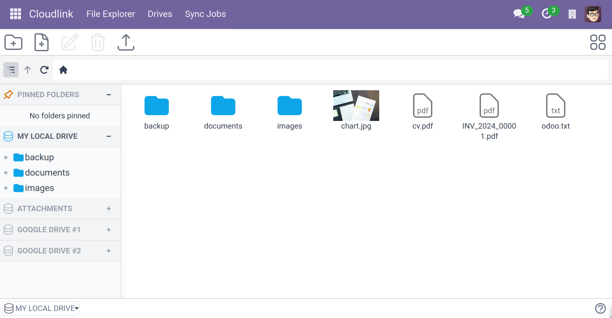

# Introduction

 is a module to connect different cloud storages to Odoo, manage your attachments, and sync your data between drives.

In other words, the module lets you integrate and manage different types of data storages. Each data storage gets mounted like a drive on a PC.

The module supports the following drive types:

- **[Local]** - Mount a local folder of the Odoo server
- **[Attachment]** - Drive to organize attachments
- **[Google Drive]**
- **[SharePoint & OneDrive]**
- **[SFTP]** - Secure File Transfer Protocol
- More drives coming soon: **WebDav**, **Dropbox**, **S3FS** ...

## Features

- **[File Explorer]**  Manage files and folders directly from the web interface.
- **[Sync Jobs]**  Schedule cron jobs to synchronize files and folders between drives. 
- **[Access Rights]**  Restrict access to certain user groups, configurable for each drive.
- **[URL Attachments]**  Attach files directly from a Cloudlink Drive.


## Glossary

**Drive** - a Cloudlink data storage

----

[Local]: 
[Attachment]: 
[Google Drive]: 
[SharePoint & OneDrive]: 
[SFTP]: 

[File Explorer]: 
[Sync Jobs]: 
[Access Rights]: #allowed-groups
[URL Attachments]: 