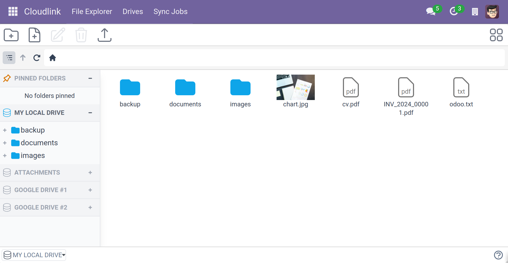

# Cloudlink Documentation

Welcome to the documentation for **Cloudlink**. Cloudlink is a comprehensive file management and storage solution for Odoo, allowing you to integrate various cloud providers and manage your files directly within the Odoo interface.

[Go to Demo]

## Overview

Cloudlink enables you to:
- **Mount Cloud Storages**: Connect [Google Drive], [Dropbox], [SharePoint & OneDrive], [Amazon S3], and [SFTP] as drives in Odoo.
- **Manage Files**: Use the integrated [File Explorer] to browse, upload, download, and organize files.
- **[Filestore]**: Use cloud drives as the backend storage for Odoo attachments (bidirectional sync).
- **Sync**: [Synchronize] files between different drives.
- **Backup**: Automatically [backup your Odoo database] to any mounted drive.
- **Share**: [Share files and folders] with external partners via the portal.

## Modules

Cloudlink consists of several modules. The core module provides the file manager and basic drive types, while extensions add support for specific providers or features.

| Feature / Provider | Module |
| :--- | :--- |
| **Core (File Explorer, Filestore, Local drives)** | `cloud_link` |
| **URL Attachments** | `cloud_link_attach` |
| **Database Backup** | `cloud_link_db` |
| **Dropbox** | `cloud_link_dropbox` |
| **Google Drive** | `cloud_link_gdrive` |
| **File Sharing (Portal)** | `cloud_link_portal` |
| **Amazon S3** | `cloud_link_s3` |
| **SFTP** | `cloud_link_sftp` |
| **SharePoint & OneDrive** | `cloud_link_sharepoint` |

[Go to Demo]: 
[Google Drive]: 
[Dropbox]: 
[SharePoint & OneDrive]: 
[Amazon S3]: 
[SFTP]: 
[File Explorer]: 
[Synchronize]: 
[backup your Odoo database]: 
[Share files and folders]: 
[Filestore]: 