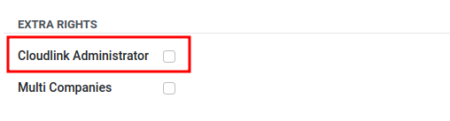

# Cloudlink Administrator

[Cloudlink] adds a new group called `Cloudlink Administrator`. Each user in the `Cloudlink Administrator` group has the following permissions:

- Create, read, update, and delete [Drives].
- Create, read, update, and delete [Sync Jobs]

## Add a user to the `Cloudlink Administrator` group

To make a user a `Cloudlink Administrator` go to **Settings > Users & Companies > Users**. 
The Cloudlink Checkbox is located in the `EXTRA RIGHTS` section of a user.

---

[Cloudlink]: 
[Drives]: 
[Sync Jobs]: 

