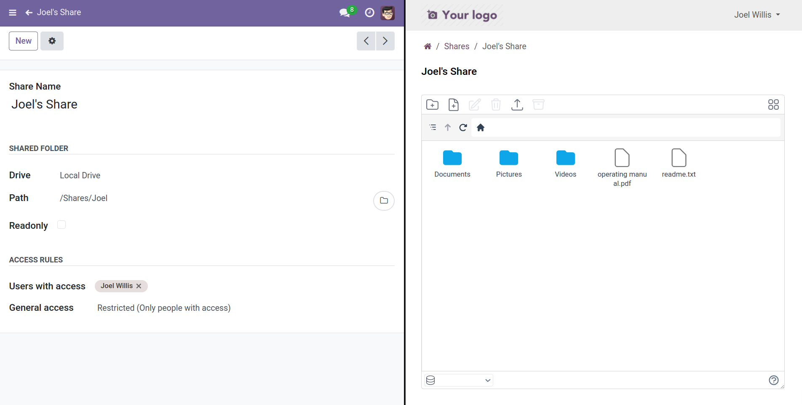
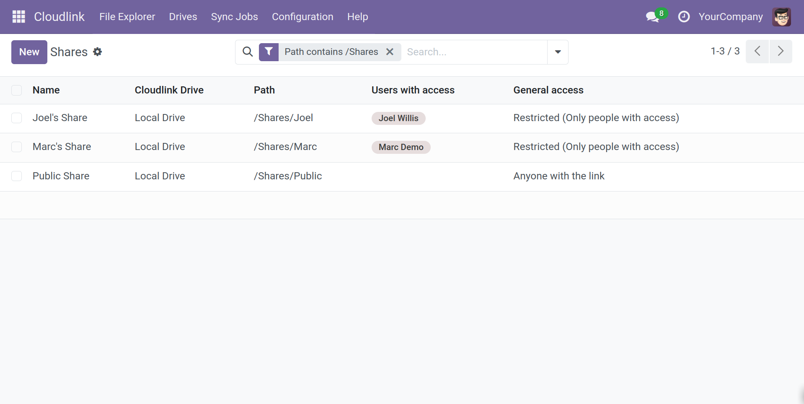
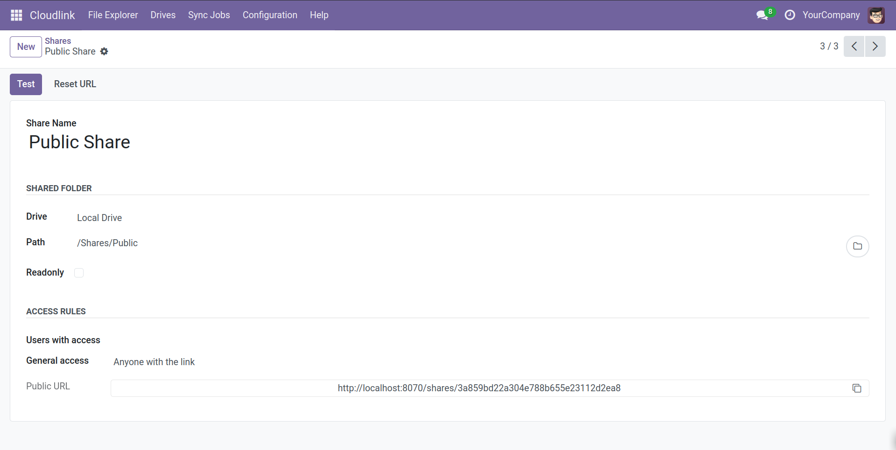
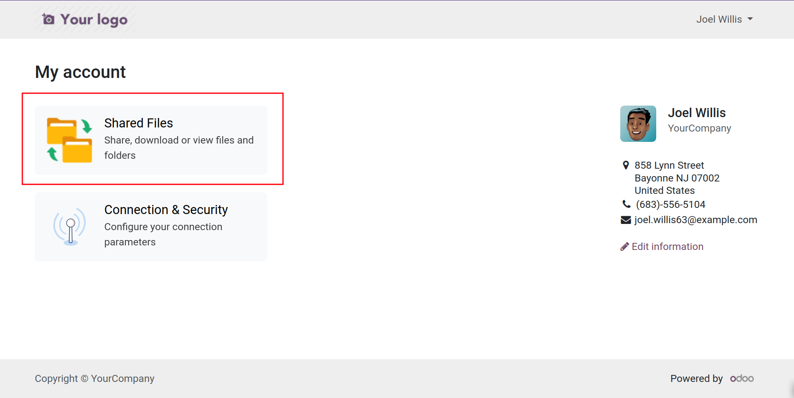

# Shares



 is a powerful Odoo module for seamless file sharing. It enables bidirectional sharing of files and folders with external partners, with options for readonly or editable access. Create public shares accessible to anyone or restricted shares for specific users, ensuring secure and flexible collaboration.

## Endpoints

This module provides the following endpoints:

- `https://<your_odoo_domain>/my/shares`  A list of shared folders
- `https://<your_odoo_domain>/my/shares/<share_id>`  Opens the specified share inside the file explorer
- `https://<your_odoo_domain>/shares/<access_token>`  Endpoint to open a public share

## Screenshots

## Share Settings

### Name

The name of the share.

### Drive

The [Cloudlink Drive] that the share is stored on.

### Path

The location of the share.

### Readonly

Makes the share readonly.

### Users with access

A list of users with access to the share.

### General access

Options:

- Restricted (Only people with access)
- Anyone with the link

[Cloudlink Drive]: 