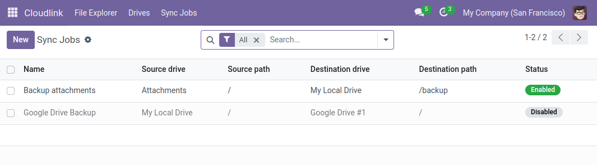
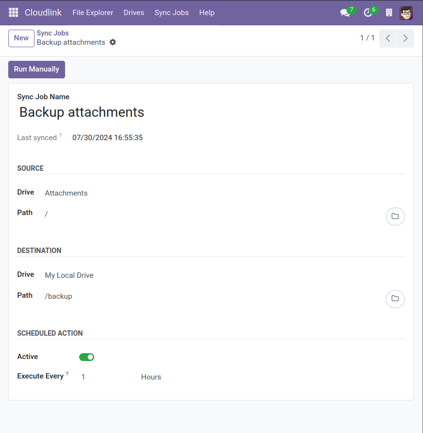

# Sync Jobs



Sync Jobs can be used to automatically copy a directory from one drive to another. The synchronization occurs automatically at the specified interval (e.g. every 24 hours). A [Cloudlink Administrator] can also manually trigger the job. 

{: .note }
With the default settings, Odoo kills workers after 120 seconds. 
For long Sync Jobs you need to increase [`limit-time-real`](https://www.odoo.com/documentation/{{site.content.version}}/developer/reference/cli.html#cmdoption-odoo-bin-limit-time-real).

## Sync Jobs Settings

### Active

Specifies whether the job is executed automatically.

### Execute Every

Run job every x Minutes/Hours/Days/Weeks/Months

[Cloudlink Administrator]: 
