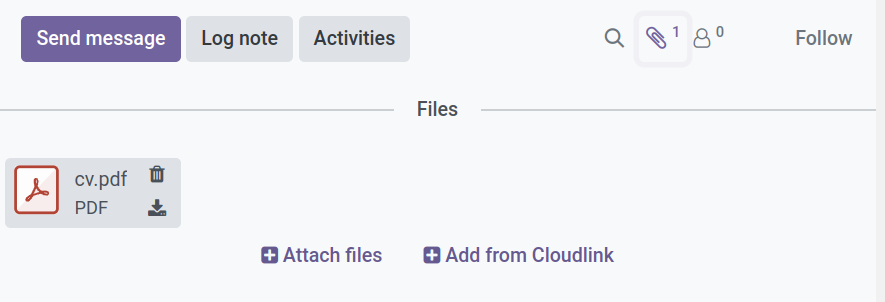

# URL Attachment



The  extension allows to attach files from a [Cloudlink Drive].
Created attachments link to the file on the drive without making a copy.

{: .highlight}
> - The drive must be mounted for the file to be accessible. 
> - The attachment will break, if ...
>   - the drive is removed
>   - the linked file does no longer exist
> - Renaming the drive has no effect on the attachment

## Create a Cloudlink Attachment

<video width="100%" controls>
  <source src="assets/url_attachment.mp4" type="video/mp4">
Your browser does not support the video tag.
</video>

[Cloudlink Drive]: 